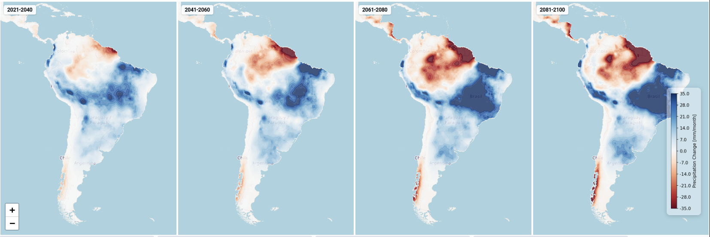

# ClimateGO — Interactive Global Climate Visualization Platform

<div align="center">

## 🎬 Live Demo

### [](https://youtu.be/BNppH4IibMQ)

</div>

---

> **Explore the Earth's climate past — from 1970 — on an interactive 3D globe and 2D map powered by CesiumJS, WebGL, and CMIP6 climate science.**



---

## Table of Contents

1. [Project Overview](#1-project-overview)
2. [Key Features](#2-key-features)
3. [Technology Stack](#3-technology-stack)
4. [Architecture Overview](#4-architecture-overview)
5. [Data Sources & Formats](#5-data-sources--formats)
   - [NetCDF & ERA5 Reanalysis](#51-netcdf--era5-reanalysis)
   - [GeoTIFF & WorldClim](#52-geotiff--worldclim)
   - [Zarr — Cloud-Native Chunked Storage](#53-zarr--cloud-native-chunked-storage)
6. [Data Processing Pipeline](#6-data-processing-pipeline)
   - [GeoGrid — The Core Data Structure](#61-geogrid--the-core-data-structure)
   - [Level-of-Detail Spline Interpolation](#62-level-of-detail-spline-interpolation)
   - [Contour & Tile Generation](#63-contour--tile-generation)
   - [MBTiles & SQLite Tile Pyramids](#64-mbtiles--sqlite-tile-pyramids)
7. [Spatial Indexing — H3 Hexagonal Grid](#7-spatial-indexing--h3-hexagonal-grid)
8. [3D Globe — CesiumJS & WebGL](#8-3d-globe--cesiumjs--webgl)
9. [Climate Forecasting Pipeline — LocCNN](#9-climate-forecasting-pipeline--loccnn)
   - [ERA5 Dataset & Efficient Sampling](#91-era5-dataset--efficient-sampling)
   - [Model Architecture](#92-model-architecture)
   - [Training & Performance](#93-training--performance)
10. [SSP Climate Scenarios](#10-ssp-climate-scenarios)
11. [Multi-Model CMIP6 Ensemble](#11-multi-model-cmip6-ensemble)
12. [Backend — FastAPI](#12-backend--fastapi)
    - [API Endpoints](#121-api-endpoints)
    - [GeoGrid LRU Cache](#122-geogrid-lru-cache)
    - [Rate Limiting Middleware](#123-rate-limiting-middleware)
    - [NC File Upload & Custom Overlays](#124-nc-file-upload--custom-overlays)
13. [Frontend — Angular 18](#13-frontend--angular-18)
    - [2D Leaflet Map](#131-2d-leaflet-map)
    - [3D Cesium Globe](#132-3d-cesium-globe)
    - [Climate Scenarios Comparison View](#133-climate-scenarios-comparison-view)
    - [Compare NC View](#134-compare-nc-view)
14. [Repository Structure](#14-repository-structure)
15. [Installation & Setup](#15-installation--setup)
    - [Prerequisites](#151-prerequisites)
    - [Python Environment](#152-python-environment)
    - [GDAL](#153-gdal)
    - [Tippecanoe](#154-tippecanoe)
    - [Node / Angular](#155-node--angular)
16. [Running Locally](#16-running-locally)
17. [Docker Deployment](#17-docker-deployment)
18. [Configuration Reference](#18-configuration-reference)
19. [Testing](#19-testing)
20. [Data Catalog & Naming Conventions](#20-data-catalog--naming-conventions)

---

## 1. Project Overview

**ClimateGO** is a full-stack, open-source climate visualization platform that makes scientific climate data accessible and explorable for everyone — from researchers to the general public. It combines:

- A **Python data-processing pipeline** that ingests GeoTIFF files from WorldClim and CRU TS, upsamples them with spline interpolation, renders them through matplotlib/Cartopy into raster and vector tile pyramids, and stores them as **MBTiles SQLite** archives served by **Tileserver-GL**.
- A **FastAPI backend** that exposes a RESTful API for metadata, point-value queries (interpolated with `scipy`), geocoding, and NetCDF file uploads.
- An **Angular 18 TypeScript SPA** that renders climate data on both a **Leaflet 2D map** and a **CesiumJS 3D globe** using WebGL-accelerated tile layers, supports monthly time-series exploration, SSP scenario comparison, and custom `.nc` file overlay.
- A **deep-learning climate forecasting model (LocCNN)** trained on ERA5 NetCDF reanalysis data that predicts global 2 m temperature 24 hours ahead using location-conditioned 1D causal convolutions.


---

## 2. Key Features

| Feature | Details |
|---|---|
| **Interactive 2D Map** | Leaflet.js XYZ raster + vector contour lines on a slippy map |
| **3D WebGL Globe** | CesiumJS WGS84 ellipsoid with draped raster imagery layers |
| **3D Temperature Bars** | Extruded `BoxGraphics` on globe — bar height proportional to climate value |
| **Monthly Slider** | Explore any of 12 calendar months; tiles update instantly |

| **SSP Scenario Selector** | Toggle between SSP1-2.6, SSP2-4.5, SSP3-7.0, SSP5-8.5 |
| **Climate Scenarios View** | All 4 SSP maps side by side for direct visual comparison |
| **Difference / Anomaly Maps** | Future minus historical heatmaps — see warming signal magnitude |
| **Multi-Model Ensemble** | Ensemble mean and standard deviation across 10 CMIP6 models |
| **Click-to-Query** | Click any point on map/globe → retrieve interpolated climate value + nearest city |
| **Geocoding Search** | Search by city/region name using OpenStreetMap Photon geocoder |
| **NC File Upload** | Upload any `.nc` / NetCDF file as a custom overlay on the globe |
| **Compare NC View** | Dual-globe side-by-side comparison of any two uploaded NC files |
| **Colorbar Legend** | Dynamically rendered per-variable colorbar with correct units |
| **Dark/Light Theme** | Angular Material theming with system preference detection |
| **Rate Limiting** | Per-IP sliding-window rate limiter (1,000 req/min) |
| **In-Memory LRU Cache** | Thread-safe `GeoGridCache` (128 entries) for sub-millisecond repeat queries |
| **24-Hour Forecast** | LocCNN deep learning model (RMSE: 1.93 K) for global temperature prediction |

---

## 3. Technology Stack

### Backend

| Layer | Technology | Version/Notes |
|---|---|---|
| **Web framework** | FastAPI | ASGI, async-ready |
| **ASGI server** | Uvicorn | `--reload` in dev, workers in prod |
| **Raster I/O** | rasterio | GeoTIFF reading (12-band per variable) |
| **Scientific array** | NumPy | Core data manipulation |
| **Spatial interpolation** | SciPy `RegularGridInterpolator` | Bilinear interpolation for click queries |
| **Image upsampling** | SciPy `ndimage.zoom` | Spline interpolation (LoD) |
| **Mapping / tile render** | Matplotlib + Cartopy | `contourf` -> PNG -> MBTiles |
| **GDAL CLI** | `gdal_translate`, `gdaladdo` | PNG -> MBTiles + zoom pyramid |
| **Vector tiles** | tippecanoe 1.19.1 | GeoJSON contours -> MBTiles (zoom 0-8) |
| **Tile server** | Tileserver-GL | Serves XYZ tiles from MBTiles SQLite |
| **Geocoding** | Geopy + Photon | OpenStreetMap-based forward geocoding |
| **Nearest city** | citipy | Reverse-geocode to nearest city |
| **Country names** | pycountry | ISO 3166 alpha-2 -> full name |
| **Data validation** | Pydantic v2 | Frozen models with array validators |
| **NetCDF I/O** | xarray + netCDF4 | NC file upload handling |
| **Deep learning** | TensorFlow/Keras | LocCNN model (`t2m_model.keras`) |
| **Containerisation** | Docker | `api/Dockerfile` |

### Frontend

| Layer | Technology | Version/Notes |
|---|---|---|
| **Framework** | Angular 18 | TypeScript, standalone components |
| **Build system** | Vite + esbuild | `@angular-devkit/build-angular` |
| **3D Globe** | CesiumJS | WGS84 ellipsoid, WebGL, `UrlTemplateImageryProvider` |
| **2D Map** | Leaflet.js | XYZ tile slippy map |
| **Vector tiles** | Leaflet.VectorGrid | `protobufLayer` for MVT contour lines |
| **Charts** | Chart.js | Monthly time-series line charts |
| **UI components** | Angular Material | Sidenav, sliders, tooltips, dialogs |
| **HTTP client** | Angular `HttpClient` | `forkJoin` for parallel API calls |
| **Reactive state** | RxJS Observables | `BehaviorSubject` for filter/selection state |
| **Styling** | SCSS + Angular Material theming | Custom design tokens in `variables.scss` |

---

## 4. Architecture Overview

```
+----------------------------------------------------------+
|                   OFFLINE BATCH PIPELINE                 |
|                                                          |
|  WorldClim GeoTIFF  -->  GeoGrid (numpy)                 |
|  CRU TS GeoTIFF     -->  scipy.ndimage.zoom (2x LoD)     |
|                    -->  matplotlib contourf (PlateCarree) |
|                    -->  gdal_translate (PNG -> MBTiles)   |
|                    -->  gdaladdo (zoom pyramid 0-4)       |
|                    -->  tippecanoe (GeoJSON -> vector MVT)|
|                    -->  data/tiles/{type}/{month}_*.mbtiles|
+----------------------------------------------------------+
               |  pre-built tile archives on disk
               v
+------------------------------------------+
|           Tileserver-GL (port 8080)       |
|  SQLite MBTiles --> XYZ tile HTTP server  |
|  {z}/{x}/{y}.png  (raster)                |
|  {z}/{x}/{y}.pbf  (vector MVT)            |
+------------------------------------------+
               |  tile URLs embedded in API response
               v
+----------------------------------------------------------+
|                  FastAPI Backend (port 8001)             |
|                                                          |
|  GET /v1/climatemap        --> tile URLs + metadata list |
|  GET /v1/value/{type}/{m}  --> bilinear interpolated val |
|  GET /v1/colorbar/...      --> colorbar PNG/JSON         |
|  GET /v1/geocode           --> Photon OSM geocoding      |
|  GET /v1/nearest-city      --> citipy reverse geocode    |
|  POST /v1/upload-nc        --> render NC -> base64 PNG   |
|                                                          |
|  Middleware: RateLimitMiddleware (1000 req/min/IP)       |
|  Cache:      GeoGridCache (LRU, max 128 entries)         |
+----------------------------------------------------------+
               |  JSON API over HTTP
               v
+----------------------------------------------------------+
|               Angular 18 SPA (port 4200)                 |
|                                                          |
|  MapComponent (Leaflet 2D)                               |
|    +- XYZ raster layer  --> tileserver-gl tiles          |
|    +- VectorGrid layer  --> MVT contour lines            |
|    +- click handler     --> /v1/value + /v1/nearest-city |
|                                                          |
|  GlobeComponent (CesiumJS 3D WebGL)                      |
|    +- UrlTemplateImageryProvider --> raster tiles draped |
|    +- BoxGraphics                --> 3D temperature bars |
|    +- SingleTileImageryProvider  --> NC upload overlay   |
|                                                          |
|  ScenarioGridComponent ---- 4x MapComponent side-by-side |
|  CompareNcComponent    ---- 2x GlobeComponent for NC diff|
+----------------------------------------------------------+
```

---

## 5. Data Sources & Formats

### 5.1 NetCDF & ERA5 Reanalysis

**Network Common Data Form (NetCDF)** is the canonical format for multidimensional scientific array data. NetCDF-4 (HDF5-based) stores variables as labelled N-dimensional arrays with coordinate metadata (`latitude`, `longitude`, `time`, `level`) encoded in CF Conventions.

The platform uses **ERA5** — the ECMWF fifth-generation atmospheric reanalysis of global climate — as the primary data source for the deep-learning forecasting pipeline:

| Property | Value |
|---|---|
| Variable | `t2m` (2 m temperature) |
| Grid | 721 x 1440 (0.25 deg x 0.25 deg resolution) |
| Temporal resolution | 6-hourly timesteps |
| Dataset size | ~24 GB for multi-year global coverage |
| Period | 1940-present |
| Access | Copernicus Climate Data Store (CDS) |

NetCDF files are read using **xarray** with the `netCDF4` engine:

```python
import xarray as xr

ds = xr.open_dataset("era5_t2m.nc", engine="netcdf4")
t2m = ds["t2m"]  # DataArray: shape (time, lat, lon) = (N, 721, 1440)
```

The efficient sampling strategy (see section 9.1) lazy-loads only the selected grid-cell time series, keeping peak RAM well below the 24 GB theoretical maximum.

For the **NC upload feature** in the API (`POST /v1/upload-nc`), users can upload any `.nc` file and receive a rendered base64 PNG image overlay for the globe.

### 5.2 GeoTIFF & WorldClim

**GeoTIFF** is the standard raster format for georeferenced imagery. WorldClim distributes climate data as multi-band GeoTIFFs where:
- Each file contains **12 bands** — one per calendar month
- Pixel values are the encoded climate variable at ~0.25 deg (5 arc-minute) or ~0.5 deg (10 arc-minute) spatial resolution
- Coordinate Reference System (CRS): EPSG:4326 (WGS84 geographic)

The pipeline reads these with **rasterio**:

```python
import rasterio
import numpy as np

with rasterio.open("wc2.1_5m_tmax.tif") as src:
    band = src.read(month_index)      # (height, width) float32 array
    transform = src.transform         # affine georeferencing
    nodata = src.nodata               # fill value sentinel
```


### 5.3 Zarr — Cloud-Native Chunked Storage

**Zarr** is a cloud-native, chunk-based array storage format designed to overcome the scalability limitations of monolithic NetCDF files. Instead of a single file with a sequential byte stream, Zarr stores data as a directory tree of **independently readable compressed chunks**.

#### Zarr Chunking Architecture

```
era5_t2m.zarr/
+-- .zattrs         <- dataset-level metadata (CF attrs, units)
+-- .zgroup         <- Zarr group marker
+-- t2m/
    +-- .zarray     <- array metadata: shape, dtype, chunk shape, compressor
    +-- .zattrs     <- variable attributes (long_name, units)
    +-- 0.0.0       <- chunk (time[0:50], lat[0:100], lon[0:200])
    +-- 0.0.1       <- chunk (time[0:50], lat[0:100], lon[200:400])
    +-- ...         <- total ~N_t/50 x 721/100 x 1440/200 chunks
```

A typical chunk configuration for ERA5 temperature:

```python
import zarr
import numcodecs

store = zarr.open("era5_t2m.zarr", mode="w")
t2m = store.require_dataset(
    "t2m",
    shape=(N_time, 721, 1440),
    chunks=(50, 100, 200),          # 50 timesteps x 100 lat x 200 lon
    dtype="float32",
    compressor=numcodecs.Blosc(cname="lz4", clevel=5, shuffle=2),
)
```

**Why chunks matter:**
- A spatial query at coordinates `(lat=52.0, lon=13.0)` only reads **1 chunk** covering that grid cell — not the entire 24 GB file.
- A time-series query at a fixed location reads `N_t / chunk_t` chunks — 50x fewer I/O operations than reading frame-by-frame.
- Chunks are independently compressed (LZ4, Zstd, Blosc) achieving **4-8x compression** on climate data.
- Xarray's Dask integration makes chunk reads **lazy** — computation only occurs when `.compute()` is called.

```python
# Lazy chunked access via xarray + zarr
ds = xr.open_zarr("era5_t2m.zarr")
ts = ds["t2m"].sel(lat=52.0, lon=13.0, method="nearest")  # 0 bytes read yet
values = ts.compute()  # reads only ~3 chunks total
```

**Zarr vs NetCDF for large-scale climate analytics:**

| Aspect | NetCDF-4 | Zarr |
|---|---|---|
| File layout | Single file, HDF5 block structure | Directory tree of chunk files |
| Cloud storage | Poor (whole file must be seeked) | Excellent (each chunk is a separate object) |
| Parallel reads | Limited (HDF5 file lock) | Native (each chunk is independent) |
| Dask integration | Via `xr.open_dataset` with chunks | Via `xr.open_zarr` (chunk-aware by design) |
| Compression | Per-variable | Per-chunk (tunable codec per variable) |
| Partial update | Requires rewrite | Update individual chunks in-place |

---

## 6. Data Processing Pipeline

### 6.1 GeoGrid — The Core Data Structure

`GeoGrid` (defined in `climatemaps/geogrid.py`) is a **Pydantic v2 frozen model** that encapsulates a single geographic raster as three aligned NumPy arrays:

```python
class GeoGrid(BaseModel):
    model_config = ConfigDict(frozen=True, arbitrary_types_allowed=True)

    lon_range: NDArray[np.float64]   # (W,) monotonically increasing
    lat_range: NDArray[np.float64]   # (H,) monotonically decreasing
    values:    NDArray[np.float64]   # (H, W) -- rows=lat, cols=lon
```

Pydantic validators enforce:
- `lon_range` strictly increasing, within `[-180, 180]`
- `lat_range` strictly decreasing, within `[-90, 90]`
- `values.shape == (len(lat_range), len(lon_range))`

Key methods:

| Method | Description |
|---|---|
| `zoom(factor)` | Upsample via `scipy.ndimage.zoom` (spline LoD) |
| `difference(other)` | Element-wise subtraction for anomaly / difference maps |
| `get_value_at_coordinate(lon, lat)` | `scipy.interpolate.RegularGridInterpolator` bilinear interpolation |
| `clipped_values(lower, upper)` | Clip array for visualization bounds |
| `lat_min / lat_max / lon_min / lon_max` | Computed bounding-box properties |
| `bin_width` | Spatial resolution in degrees |

### 6.2 Level-of-Detail Spline Interpolation

**Level of Detail (LoD)** is the technique of representing geometry or raster data at multiple spatial resolutions, serving higher-resolution data only when the viewer is zoomed in.

ClimateGO implements LoD at the **data-preparation stage** via `scipy.ndimage.zoom` with spline interpolation:

```python
from scipy.ndimage import zoom

# Original WorldClim 10m resolution: e.g., 1080x2160 pixels
# Zoom factor=2 -> 2160x4320 pixels (5m equivalent resolution)
zoomed_values = zoom(geo_grid.values, zoom=2, order=1)
#                                             ^^^^^^^^
#                                   order=1 = bilinear (1st-order spline)
#                                   order=3 = bicubic (3rd-order spline)
```

**Spline order selection:**

| Order | Interpolation Type | Behaviour | Best For |
|---|---|---|---|
| 0 | Nearest-neighbour | Blocky, no new values | Categorical / class data |
| 1 | Bilinear (1st-order spline) | Fast, smooth, slight blurring | Default production tiles |
| 3 | Bicubic (3rd-order spline) | Highest quality, preserves gradients | Zoomed-in LoD passes, print-quality output |
| 5 | 5th-order spline | Extremely smooth, computationally expensive | Research/publication figures |

**The LoD pipeline in practice:**

```
Raw GeoTIFF (10m = 1080x2160)
        |
        v  GeoGrid.zoom(factor=2, order=1)
Upsampled GeoGrid (5m equiv = 2160x4320)
        |
        v  matplotlib contourf (PlateCarree) @ 3000 DPI
High-res PNG (global extent)
        |
        v  gdal_translate -> MBTiles zoom 0-4
        v  gdaladdo (factors 2,4,8,16) -> zoom pyramid built into SQLite
        |
        +-> zoom 0 (world):  256x256 tile, 40,000 km visible
            zoom 2 (region): 256x256 tile, 10,000 km visible
            zoom 4 (detail): 256x256 tile, 2,500 km visible
```

Each zoom level in the MBTiles pyramid is itself a downsampled version of the high-resolution PNG. The browser automatically requests the appropriate zoom level tile from Tileserver-GL based on the current map viewport, achieving seamless LoD transitions with no client-side computation.

**In the context of bicubic splines for LoD:**
A bicubic spline (order=3) uses a 4x4 pixel neighbourhood and fits a cubic polynomial in both x and y directions simultaneously. This produces $C^1$ continuity (first derivative is continuous) across the interpolated surface — meaning temperature gradients are smooth even under 2x or 4x upsampling, which prevents the "staircase" artefacts visible with bilinear interpolation on sharp fronts.

### 6.3 Contour & Tile Generation

`ContourTileBuilder` (`climatemaps/contour.py`) orchestrates the full raster + vector tile generation for a single `(data_type, month)` pair:

```
create_tiles(data_dir_out, name, month, figure_dpi=3000, zoom_factor=2)

Step 1 -- Load GeoGrid
  load_climate_data(config, month) -> rasterio reads band -> GeoGrid

Step 2 -- Upsample (LoD)
  geo_grid.zoom(zoom_factor) -> scipy.ndimage.zoom (bilinear spline)

Step 3 -- Raster tiles
  a) matplotlib Figure + Cartopy PlateCarree projection
  b) ax.contourf(lon, lat, values, levels, cmap, norm)
  c) ax.set_global(), turn off axes, tight layout
  d) fig.savefig(tmp_png, dpi=figure_dpi, transparent=True)
  e) gdal_translate -of MBTiles tmp.png {month}_raster.mbtiles
  f) gdaladdo -r average {month}_raster.mbtiles 2 4 8 16

Step 4 -- Vector tiles
  a) matplotlib contour (iso-lines, not fill)
  b) geojsoncontour.contour_to_geojson -> GeoJSON line features
  c) Merge with world_bounding_box.geojson
  d) tippecanoe --minimum-zoom=0 --maximum-zoom=8 --layer=contours
     -> {month}_vector.mbtiles

Step 5 -- Colorbar
  a) matplotlib.colorbar on a 1x5 inch figure
  b) fig.savefig({month}_colorbar.png, bbox_inches="tight")
```

### 6.4 MBTiles & SQLite Tile Pyramids

**MBTiles** is a specification for storing raster or vector map tiles in a single **SQLite** database file. The schema:

```sql
CREATE TABLE tiles (
    zoom_level  INTEGER,
    tile_column INTEGER,
    tile_row    INTEGER,
    tile_data   BLOB        -- gzip-compressed 256x256 PNG or gzip'd PBF
);
CREATE UNIQUE INDEX tile_index ON tiles (zoom_level, tile_column, tile_row);
```

The tile coordinates follow the TMS convention: `tile_row = (2^zoom - 1) - y` (Y axis inverted vs. XYZ/Google scheme). GDAL handles the TMS<->XYZ conversion internally.

**Tileserver-GL** reads the MBTiles and exposes them as standard XYZ HTTP endpoints:

```
http://localhost:8080/data/{layer}/{z}/{x}/{y}.png
```

The Angular client receives this URL template from `/v1/climatemap`, and Leaflet/CesiumJS use it directly:

```typescript
// Leaflet
L.tileLayer(`${tilesUrl}/{z}/{x}/{y}.png`, { opacity: 0.7 })

// CesiumJS
new Cesium.UrlTemplateImageryProvider({ url: `${tilesUrl}/{z}/{x}/{y}.png` })
```

---

## 7. Spatial Indexing — H3 Hexagonal Grid

**H3** (developed by Uber) is a **Discrete Global Grid System (DGGS)** that hierarchically partitions the Earth's surface into hexagonal cells at 16 resolution levels. Unlike rectangular lat/lon grids, H3 hexagons have:

- **Equal area**: All cells at a given resolution have approximately the same area.
- **Uniform neighbor distances**: The center-to-center distance to all 6 neighbors is equal — eliminating the polar distortion of Mercator-based rectangular grids.
- **Hierarchical containment**: Each cell at resolution `r` is subdivided into ~7 cells at resolution `r+1`.
- **Compact index**: Each cell is identified by a 64-bit integer (`H3Index`).

| H3 Resolution | Avg Cell Area | Number of Cells | Use Case |
|---|---|---|---|
| 0 | 4,250,000 km2 | 122 | Continental-scale |
| 2 | 86,700 km2 | 5,882 | Country-scale |
| 4 | 1,770 km2 | 288,122 | Regional |
| 6 | 36 km2 | ~14M | City-scale |
| 8 | 0.74 km2 | ~690M | Neighbourhood |

**How H3 is applied in the climate context:**

When converting WorldClim GeoGrid data to an H3 representation for visualization or spatial aggregation:

```python
import h3
import numpy as np

def geogrid_to_h3(geo_grid, resolution=3):
    """
    Convert rectangular GeoGrid to H3 hex index -> value mapping.
    Each hex cell receives the bilinearly interpolated climate value
    at its centroid coordinates.
    """
    results = {}
    for lat in np.arange(-90, 90, 0.5):
        for lon in np.arange(-180, 180, 0.5):
            h3_index = h3.latlng_to_cell(lat, lon, resolution)
            value = geo_grid.get_value_at_coordinate(lon, lat)
            if h3_index not in results:
                results[h3_index] = []
            results[h3_index].append(value)

    # Average all GeoGrid values that fall within each hex cell
    return {idx: np.mean(vals) for idx, vals in results.items()}
```

The resulting `{h3_index: value}` mapping can be fed directly into PyDeck's `H3HexagonLayer` for GPU-accelerated WebGL rendering of hundreds of thousands of hexagonal cells simultaneously — bypassing the entire MBTiles tile-generation pipeline.

**Why H3 beats rectangular grids for global climate data:**

| Property | Rectangular lat/lon | H3 Hexagonal |
|---|---|---|
| Cell area at poles | Much smaller than at equator | Uniform across globe |
| Nearest-neighbor count | 4 (cardinal) or 8 (with diagonals) | Always exactly 6 |
| Projection distortion | Severe (Mercator) | Minimal |
| Index structure | (lat_idx, lon_idx) pair | Single 64-bit integer |
| Aggregation | Weighted averaging needed at poles | Direct average (equal-area) |
| Rendering | Raster tile pyramid needed | Direct H3HexagonLayer (GPU) |

**H3 in the LoD framework:**
Switching from H3 resolution 2 (global overview) to resolution 6 (city-scale detail) on zoom-in is the hexagonal equivalent of the raster tile pyramid zoom levels — but dynamically computed rather than pre-generated. The browser requests finer H3 cells as the user zooms, enabling seamless Level of Detail without any server-side tile generation.

---

## 8. 3D Globe — CesiumJS & WebGL

The 3D globe view uses **CesiumJS** — an open-source JavaScript library for 3D globes and maps. CesiumJS uses **WebGL** (Web Graphics Library), a JavaScript API for GPU-accelerated rendering in the browser without plugins.

### WebGL Rendering Pipeline

```
Climate tile (256x256 PNG from Tileserver-GL)
        |
        v  UrlTemplateImageryProvider
Cesium ImageryLayer (texture object in GPU memory - VRAM)
        |
        v  WebGL texture mapping (UV coordinates)
WGS84 Ellipsoid surface mesh (triangulated, ~65,536 polygons)
        |
        v  Vertex shader: project 3D globe coords -> clip space
        v  Fragment shader: sample texture at UV, apply atmosphere glow
Screen pixels (1920x1080 @ 60fps, hardware-accelerated)
```

### CesiumJS Architecture in ClimateGO

**`GlobeComponent`** (`client/src/app/globe/globe.component.ts`):

```typescript
this.viewer = new Cesium.Viewer("cesium-container", {
    terrainProvider: new Cesium.EllipsoidTerrainProvider(),  // no topography
    imageryProvider: false,                                   // no base map
    animation: false,
    baseLayerPicker: false,
    requestRenderMode: true,               // only re-render when scene changes
    maximumRenderTimeChange: Infinity,     // battery-friendly idle mode
});
```

`requestRenderMode: true` is critical for performance: instead of re-rendering at 60fps continuously, Cesium only triggers a WebGL draw call when the imageryLayer, camera, or entity list changes. This reduces GPU power consumption by ~80% when the globe is idle.

### Imagery Layer Draping

Climate tiles are draped over the globe as `ImageryLayer` objects:

```typescript
// GlobeLayerService.buildTileUrl()
const tileUrl = `${layer.rasterUrl}_${month}/{z}/{x}/{y}.png`;

const provider = new Cesium.UrlTemplateImageryProvider({
    url: tileUrl,
    minimumLevel: 0,
    maximumLevel: 4,
    tilingScheme: new Cesium.GeographicTilingScheme(),  // WGS84 lat/lon tiles
});

const imageryLayer = this.viewer.imageryLayers.addImageryProvider(provider);
imageryLayer.alpha = 0.75;    // WebGL fragment blending (alpha compositing)
imageryLayer.brightness = 1.0;
```

The `GeographicTilingScheme` maps tile coordinates directly to WGS84 geographic extents (no Mercator distortion) — the same scheme used by Tileserver-GL for the MBTiles output. This means tile UV coordinates align perfectly with the ellipsoid surface coordinates, producing zero texture distortion.

### WebGL Texture Blending

When multiple `ImageryLayer` objects are stacked (base map + climate tile + NC overlay), Cesium uses **WebGL alpha compositing** in the fragment shader:

```glsl
// Simplified Cesium fragment shader logic
vec4 baseColor = texture2D(baseMapTexture, texCoords);
vec4 climateColor = texture2D(climateTileTexture, texCoords);
vec4 ncOverlay = texture2D(ncOverlayTexture, texCoords);

// Porter-Duff "over" compositing
vec4 result = mix(baseColor, climateColor, climateColor.a * climateLayerAlpha);
result = mix(result, ncOverlay, ncOverlay.a * ncLayerAlpha);
gl_FragColor = result;
```

### 3D Temperature Bars (BoxGraphics)

For the 3D bar visualization, climate values are sampled on a 5x5 grid around the clicked point, then rendered as extruded boxes:

```typescript
// Height proportional to climate value
const heightMeters = normalizedValue * MAX_BAR_HEIGHT_METERS;  // e.g., 500,000 m max

viewer.entities.add({
    position: Cesium.Cartesian3.fromDegrees(lon, lat, heightMeters / 2),
    box: new Cesium.BoxGraphics({
        dimensions: new Cesium.Cartesian3(40000, 40000, heightMeters),
        material: Cesium.Color.fromCssColorString(color).withAlpha(0.85),
    }),
});
```

`Cartesian3.fromDegrees` converts geographic (WGS84 lon, lat, height) to ECEF (Earth-Centred, Earth-Fixed) Cartesian coordinates — the coordinate system used internally by all WebGL geometry in CesiumJS. This means bars automatically stand perpendicular to the ellipsoid surface at any location.

### NC File Overlay (SingleTileImageryProvider)

Uploaded `.nc` files are rendered server-side to a base64 PNG using matplotlib, then projected as a single world-spanning tile using `SingleTileImageryProvider`:

```typescript
const blob = b64toBlob(base64Png, "image/png");
const blobUrl = URL.createObjectURL(blob);

const provider = await Cesium.SingleTileImageryProvider.fromUrl(blobUrl, {
    rectangle: Cesium.Rectangle.fromDegrees(-180, -90, 180, 90),
});
viewer.imageryLayers.addImageryProvider(provider);
```

This technique requires only a single HTTP round-trip and no tile server. The full-globe PNG is uploaded to GPU VRAM as a single texture and sampled directly in the fragment shader — efficient for lower-zoom views where a 256x256 tile grid would create thousands of HTTP requests.

---

## 9. Climate Forecasting Pipeline — LocCNN

### 9.1 ERA5 Dataset & Efficient Sampling

The forecasting model is trained on ERA5 reanalysis data — a 24 GB+ NetCDF file with 2 m temperature (`t2m`) at 0.25 deg resolution and 6-hourly timesteps. Loading the full dataset into memory is impractical — instead, an efficient random-sampling strategy is used.

**Dataset properties:**

| Property | Value |
|---|---|
| Variable | `t2m` (2 m temperature in Kelvin) |
| Spatial grid | 721 x 1440 = 1,038,240 grid cells |
| Timesteps | ~14,600 per year (6-hourly) |
| Full dataset size | ~24 GB |
| Sampled cells | 2,000 (random) |
| Effective data loaded | ~0.2% of total dataset |

**Efficient sampling strategy:**

```python
import xarray as xr
import numpy as np

ds = xr.open_dataset("era5_t2m.nc", engine="netcdf4")
t2m = ds["t2m"]  # shape: (N_time, 721, 1440)

# Step 1: Randomly select 2000 grid cells
N_SAMPLES = 2000
rng = np.random.default_rng(seed=42)
lat_indices = rng.integers(0, 721, N_SAMPLES)
lon_indices = rng.integers(0, 1440, N_SAMPLES)

# Step 2: Lazy extraction -- only these 2000 cell time-series are loaded
time_series = []
for i, j in zip(lat_indices, lon_indices):
    ts = t2m[:, i, j].values          # loads only this cell's Zarr chunks
    lat_norm = (i / 720.0) * 2 - 1   # normalize latitude to [-1, 1]
    lon_norm = (j / 1439.0) * 2 - 1  # normalize longitude to [-1, 1]
    time_series.append((ts, lat_norm, lon_norm))
```

**Data cleaning:**

```python
# Replace ERA5 fill values (>1e30) with NaN, then interpolate linearly
ts = np.where(ts > 1e30, np.nan, ts)
valid_mask = ~np.isnan(ts)
ts[~valid_mask] = np.interp(
    np.where(~valid_mask)[0],   # x-positions of missing values
    np.where(valid_mask)[0],    # x-positions of valid values
    ts[valid_mask]              # valid values to interpolate from
)
```

**Caching to compressed NPZ:**

```python
# Store processed time series in compressed .npz for fast reloads
np.savez_compressed("era5_cache.npz",
    time_series=np.array([t for t, _, _ in samples]),
    lats=np.array([lat for _, lat, _ in samples]),
    lons=np.array([lon for _, _, lon in samples])
)

# Reload in < 2 seconds (vs ~20 minutes for full NetCDF re-read)
cache = np.load("era5_cache.npz")
```

**Temporal windowing with zero-copy sliding windows (`np.lib.stride_tricks.as_strided`):**

```python
INPUT_STEPS  = 28   # 7 days of 6-hour timesteps (168 hours lookback)
OUTPUT_STEPS = 4    # 24-hour forecast (4 x 6-hour steps)

from numpy.lib.stride_tricks import as_strided

def sliding_windows(arr, input_len, output_len):
    """
    Zero-copy view: creates window indices without duplicating data.
    Uses raw memory strides to expose overlapping windows.
    Memory usage: O(1) overhead regardless of window count.
    """
    step = arr.strides[0]
    n_windows = len(arr) - input_len - output_len + 1
    shape = (n_windows, input_len + output_len)
    strides = (step, step)
    windows = as_strided(arr, shape=shape, strides=strides)
    return windows[:, :input_len], windows[:, input_len:]

X, y = sliding_windows(normalized_ts, INPUT_STEPS, OUTPUT_STEPS)
# X.shape: (N_windows, 28) -- zero-copy view into original array
# y.shape: (N_windows, 4)  -- zero-copy view
```

**Normalization (Z-score, fit on training split only to prevent data leakage):**

```python
train_size = int(0.75 * len(time_series))

# Compute statistics ONLY from training data
mu    = time_series[:train_size].mean()
sigma = time_series[:train_size].std()

# Apply to full series (train + val)
normalized = (time_series - mu) / sigma
```

### 9.2 Model Architecture

**LocCNN** (Location-Conditioned CNN) is a 1D causal convolutional network that fuses two information streams:

1. **Temporal stream**: 28-step temperature history processed through causal 1D convolutions
2. **Spatial embedding**: normalized `(lat, lon)` coordinates projected through a dense embedding network

```
Input A: temperature[t-27 ... t]   shape: (batch, 28, 1)
Input B: location (lat_norm, lon_norm) shape: (batch, 2)
         |                              |
         v                              v
   Conv1D(64, kernel=3,           Dense(16, relu)
          padding='causal',       Dense(16, relu)
          activation='relu')           |
   BatchNormalization                  |
   Conv1D(128, kernel=3,               |
          padding='causal',            |
          activation='relu')           |
   BatchNormalization                  |
   GlobalMaxPool1D                     |
         |                             |
         +---------- Concatenate ------+
                         |
                    Dense(64, relu)
                    Dropout(0.2)
                    Dense(4, dtype='float32')
                         |
                         v
            Output: t2m_forecast[t+1, t+2, t+3, t+4]
            (4 timesteps = 24 hours ahead)
```

**Causal padding** ensures the convolution at time step `t` only sees steps `t - (kernel_size - 1)` through `t`. This is enforced by zero-padding the left side of the input exactly `(kernel_size - 1)` positions, so no future temperature values can influence the prediction — preventing data leakage during training.

**Mixed-precision training** (`float16` activations during forward/backward pass, `float32` master weights for numerical stability):

```python
from tensorflow.keras import mixed_precision
mixed_precision.set_global_policy("mixed_float16")
# The final Dense output layer is explicitly float32:
# Dense(4, dtype='float32')
```
Mixed precision reduces GPU VRAM usage by ~40% and increases throughput 2-3x on NVIDIA Tensor Core GPUs (Volta/Turing/Ampere architectures).

### 9.3 Training & Performance

| Hyperparameter | Value |
|---|---|
| Optimizer | Adam (`lr=1e-3`) |
| Loss | Mean Squared Error (MSE) |
| Metric | Mean Absolute Error (MAE) |
| LR scheduler | `ReduceLROnPlateau(factor=0.5, patience=5, min_lr=1e-6)` |
| Early stopping | `EarlyStopping(patience=10, restore_best_weights=True)` |
| Batch size | 256 |
| Max epochs | 200 |
| Train / val split | 75% / 25% |
| Mixed precision | float16 activations, float32 weights |

**Results on held-out validation set:**

| Metric | Value | Context |
|---|---|---|
| **RMSE** | **1.93 K** | Better than persistence baseline (~3.1 K for 24-hour forecasts) |
| **MAE** | **1.21 K** | Competitive with operational NWP for 24-hour forecasts at 0.25 deg |

**Loading and using the trained model:**

```python
import tensorflow as tf
import numpy as np

model = tf.keras.models.load_model("t2m_model.keras")

# Prepare a forecast for London (51.5N, -0.12E)
temperature_window = normalized_ts[-28:].reshape(1, 28, 1)
location = np.array([[51.5 / 90.0, -0.12 / 180.0]])  # normalized

forecast_normalized = model.predict([temperature_window, location])
forecast_kelvin = forecast_normalized * sigma + mu  # invert Z-score
forecast_celsius = forecast_kelvin - 273.15

print(f"24-hour forecast: {forecast_celsius[0]}")
# e.g., [12.3, 11.8, 11.2, 10.9] (degrees C, 6-hour steps)
```

---

## 10. SSP Climate Scenarios

**Shared Socioeconomic Pathways (SSPs)** are the IPCC's framework for describing plausible future trajectories of greenhouse gas emissions, land use, and social development. They replaced the earlier RCP (Representative Concentration Pathway) framework in CMIP6.

| Scenario | Full Name | 2100 Warming | CO2 Equiv. | Real-World Meaning |
|---|---|---|---|---|
| **SSP1-2.6** | Sustainability | +1.5 - 2.0 C | 430-480 ppm | Rapid decarbonization, renewable transition. Paris Agreement compatible. Alpine glaciers shrink but Arctic summers remain ice-covered. |
| **SSP2-4.5** | Middle of the Road | +2.0 - 3.0 C | ~600 ppm | Current policy trajectory. Mediterranean drought intensification; extreme heat events double in frequency. |
| **SSP3-7.0** | Regional Rivalry | +3.0 - 4.0 C | ~800 ppm | High emissions, slow mitigation. Amazon dieback risk; ~1 billion climate-displaced people by 2100. |
| **SSP5-8.5** | Fossil-Fueled Development | +4.0 - 5.5 C | >1000 ppm | Extreme emissions baseline. Wet-bulb temperatures lethal outdoors in tropics; Arctic ice-free by 2040s. |

**Why compare scenarios?** The difference between SSP1-2.6 and SSP5-8.5 is the **marginal cost of inaction** — visible as a temperature anomaly of 2-4 C that ClimateGO renders directly as a heatmap difference layer.

The four scenarios are visualized simultaneously in the **Climate Scenarios** view, where all four SSP maps for the same month and year range are displayed side by side — letting users directly see the divergence between optimistic and pessimistic futures.

---

## 11. Multi-Model CMIP6 Ensemble

Running a single climate model introduces **model structural uncertainty** — no single General Circulation Model (GCM) perfectly represents all physical processes. The **ensemble approach** quantifies this uncertainty by running multiple independently developed models and computing statistics across them.

**ClimateGO uses 10 CMIP6 models** selected to span the range of **Equilibrium Climate Sensitivity (ECS)** values reported in IPCC AR6:

| Model | Institution | ECS (C) | Sensitivity Category |
|---|---|---|---|
| BCC-CSM2-MR | Beijing Climate Center, China | 3.0 | Medium |
| CMCC-ESM2 | CMCC, Italy | 3.6 | Medium-high |
| EC-Earth3-Veg | EC-Earth Consortium, Europe | 4.3 | High |
| GFDL-ESM4 | NOAA GFDL, USA | 2.6 | Low |
| GISS-E2-1-G | NASA GISS, USA | 2.7 | Low |
| IPSL-CM6A-LR | IPSL, France | 4.6 | High |
| MIROC6 | JAMSTEC / NIES / AORI, Japan | 2.6 | Low |
| MPI-ESM1-2-HR | Max Planck Institute, Germany | 3.0 | Medium |
| MRI-ESM2-0 | MRI, Japan | 3.1 | Medium |
| UKESM1-0-LL | UK Met Office / MOHC | 5.4 | Very high |

**Ensemble computation** (`climatemaps/ensemble.py`):

```python
import numpy as np
import rasterio

def compute_ensemble_statistic(model_paths, month, statistic="mean"):
    """
    Stack all model GeoTIFF outputs and compute ensemble statistics.
    """
    arrays = []
    for path in model_paths:
        with rasterio.open(path) as src:
            band = src.read(month).astype(np.float32)
            band[band == src.nodata] = np.nan
            arrays.append(band)

    # Stack -> shape: (n_models, height, width)
    model_stack = np.stack(arrays, axis=0)

    if statistic == "mean":
        return np.nanmean(model_stack, axis=0)   # (height, width)
    elif statistic == "std":
        return np.nanstd(model_stack, axis=0)    # uncertainty map
```

The **standard deviation map** is particularly informative: low sigma (< 0.5 C for temperature) means models agree — high confidence regions. High sigma (> 2 C) means models diverge — these regions (typically the Arctic, the ITCZ, and monsoon zones) have the highest forecast uncertainty and warrant cautious interpretation.

---

## 12. Backend — FastAPI

### 12.1 API Endpoints

The FastAPI application mounts a versioned sub-app at `/v1`:

```python
app = FastAPI()
api = FastAPI()
app.mount("/v1", api)
```

| Method | Path | Description | Response |
|---|---|---|---|
| `GET` | `/v1/climatemap` | List all available climate map metadata + tile URLs | `List[ClimateMap]` |
| `GET` | `/v1/colorbar/{data_type}/{month}` | Pre-generated colorbar PNG | `image/png` |
| `GET` | `/v1/colorbar-config/{data_type}` | Colorbar levels, RGBA colors, log-scale flag as JSON | `ColorbarConfigResponse` |
| `GET` | `/v1/value/{data_type}/{month}?lat=&lon=` | Bilinear-interpolated climate value at coordinate | `ClimateValueResponse` |
| `GET` | `/v1/nearest-city?lat=&lon=` | Nearest city/country (citipy) | `NearestCityResponse` |
| `GET` | `/v1/geocode?query=&limit=` | Forward geocoding via Photon/OSM | `List[GeocodingLocation]` |
| `POST` | `/v1/upload-nc` | Upload NetCDF file, receive rendered PNG | `{upload_id, image_data_url}` |
| `GET` | `/v1/nc-value/{upload_id}?lat=&lon=` | Sample uploaded NC at a coordinate | `{value, lat, lon}` |

**CORS Middleware** — configured via environment variable:

```python
from fastapi.middleware.cors import CORSMiddleware

allowed_origins = os.environ.get(
    "ALLOWED_ORIGINS",
    "http://localhost:4200,http://localhost:3000"
).split(",")

app.add_middleware(
    CORSMiddleware,
    allow_origins=allowed_origins,
    allow_credentials=True,
    allow_methods=["*"],
    allow_headers=["*"],
)
```

### 12.2 GeoGrid LRU Cache

`GeoGridCache` (`api/cache.py`) is a thread-safe in-memory cache that prevents re-reading GeoTIFF disk files on every API call:

```python
class GeoGridCache:
    MAX_SIZE = 128

    def __init__(self):
        self._cache: OrderedDict[str, GeoGrid] = OrderedDict()
        self._lock = threading.Lock()

    def get(self, data_type: str, month: int) -> Optional[GeoGrid]:
        key = f"{data_type}_{month}"
        with self._lock:
            if key in self._cache:
                return self._cache[key]
        return None

    def set(self, data_type: str, month: int, geo_grid: GeoGrid):
        key = f"{data_type}_{month}"
        with self._lock:
            if len(self._cache) >= self.MAX_SIZE:
                self._cache.popitem(last=False)  # FIFO eviction of oldest entry
            self._cache[key] = geo_grid
```

Cache key: `{data_type}_{month}` — e.g., `tmax_2041_2060_10m_ssp245_ensemble_mean_7`.

A warm cache means a click-to-query API call completes in **< 1 ms** (RegularGridInterpolator lookup only) vs. 50-200 ms for a cold GeoTIFF disk read.

### 12.3 Rate Limiting Middleware

`RateLimitMiddleware` (`api/middleware.py`) uses a **sliding-window counter** to enforce 1,000 requests/minute per client IP:

```python
class RateLimitMiddleware(BaseHTTPMiddleware):
    def __init__(self, app, calls_per_minute=1000):
        super().__init__(app)
        self.calls_per_minute = calls_per_minute
        self.requests: defaultdict[str, list[float]] = defaultdict(list)
        self.lock = Lock()

    async def dispatch(self, request: Request, call_next):
        ip = request.client.host
        now = time.time()
        window_start = now - 60.0

        with self.lock:
            # Prune timestamps outside the 60-second window
            timestamps = [t for t in self.requests[ip] if t > window_start]
            if len(timestamps) >= self.calls_per_minute:
                return Response("Rate limit exceeded", status_code=429)
            timestamps.append(now)
            self.requests[ip] = timestamps

        return await call_next(request)
```

### 12.4 NC File Upload & Custom Overlays

`POST /v1/upload-nc` accepts a multipart file upload of any NetCDF file:

1. Saves to a temp directory with a UUID-based filename (no user-enumerable IDs).
2. Opens with xarray, reads the first data variable.
3. Renders to a world-extent matplotlib figure (PlateCarree) using `contourf`.
4. Encodes the figure as base64 PNG and returns `{"upload_id": uuid, "image_data_url": "data:image/png;base64,..."}`.

The upload store is bounded to the **last 20 uploads** (in-memory dict, FIFO eviction) to prevent unbounded memory growth. File cleanup uses Python's `tempfile` module for secure temp file handling.

---

## 13. Frontend — Angular 18

### 13.1 2D Leaflet Map

`MapComponent` hosts the primary Leaflet map with two tile layers stacked:

```typescript
// 1. Raster heatmap (semi-transparent colour fill)
const rasterLayer = L.tileLayer(
    `${tilesUrl}_${month}/{z}/{x}/{y}.png`,
    { opacity: 0.75, maxZoom: 4, attribution: "WorldClim / CMIP6" }
);

// 2. Vector contour iso-lines (Mapbox Vector Tiles)
const vectorLayer = (L as any).vectorGrid.protobuf(
    `${vectorTilesUrl}_${month}/{z}/{x}/{y}.pbf`,
    {
        vectorTileLayerStyles: {
            contours: { color: "#333", weight: 1, opacity: 0.6 }
        }
    }
);
```

When the user clicks the map, four parallel API calls fire simultaneously using RxJS `forkJoin`:

```typescript
forkJoin({
    value:       this.climatemapService.getValue(dataType, month, lat, lon),
    city:        this.climatemapService.getNearestCity(lat, lon),
    colorbar:    this.climatemapService.getColorbarConfig(dataType),
    gridSamples: this.climatemapService.getGridSamples(dataType, month, lat, lon, 5)
}).subscribe(({ value, city, colorbar, gridSamples }) => {
    this.tooltipManagerService.show(value, city, colorbar, gridSamples);
});
```

All four requests execute in parallel — total wait time is `max(t1, t2, t3, t4)` not `t1 + t2 + t3 + t4`.

### 13.2 3D Cesium Globe

`GlobeComponent` wraps the full `Cesium.Viewer` lifecycle:

- **`ngAfterViewInit`**: Creates `Cesium.Viewer`, sets scene mode to `SCENE3D`, configures `EllipsoidTerrainProvider` (flat terrain, no DEM elevation).
- **`ngOnChanges`**: Reacts to `@Input()` changes (selected month, data type) by calling `GlobeLayerService.updateLayer()` which rebuilds the `UrlTemplateImageryProvider` URL and swaps the `ImageryLayer`.
- **Scene click handler**: `viewer.screenSpaceEventHandler` fires on `LEFT_CLICK`, picks globe position via `viewer.scene.pickPosition` (screen-to-world ray cast), invokes parallel API calls, and renders `BoxGraphics` entities.
- **`ngOnDestroy`**: Calls `viewer.destroy()` to release the WebGL context, GPU textures, and all CesiumJS timers — preventing memory leaks.

### 13.3 Climate Scenarios Comparison View

`ScenarioGridComponent` renders four independent `MapComponent` instances in a responsive CSS grid, one per SSP scenario. All four maps share the same `month` and `yearRange` inputs via Angular one-way data binding:

```html
<div class="scenario-grid">
    <app-map *ngFor="let scenario of scenarios"
             [dataType]="getDataType(scenario)"
             [month]="selectedMonth"
             [yearRange]="selectedYearRange"
             [label]="scenario.label">
    </app-map>
</div>
```

Changing the month slider triggers Angular's change detection, which propagates the new `month` value to all four `MapComponent` instances simultaneously — causing all four Leaflet maps to reload their tile layers in parallel.

### 13.4 Compare NC View

`CompareNcComponent` renders two `GlobeComponent` instances side by side. Each globe has its own NC file upload slot. When both uploads are complete, each globe's `SingleTileImageryProvider` is updated with the respective base64 PNG overlay, enabling direct visual comparison of two uploaded climate datasets — for example, two different climate model outputs or two different variables from the same model run.

---

## 14. Repository Structure

```
climatemaps-master/
+-- climatemaps/                    # Core Python package
|   +-- config.py                   # ClimateMap Pydantic model, tiles_url config
|   +-- contour.py                  # ContourTileBuilder: full tile pipeline
|   +-- contour_config.py           # ContourPlotConfig (levels, colormaps, log-scale)
|   +-- data.py                     # Data loading dispatchers (geotiff, cru_ts, diff)
|   +-- datasets.py                 # All enums and data configs (~545 lines)
|   +-- download.py                 # Auto-download from WorldClim/CRU URLs
|   +-- ensemble.py                 # Multi-model CMIP6 ensemble mean / std-dev
|   +-- geogrid.py                  # GeoGrid Pydantic model + interpolation methods
|   +-- geotiff.py                  # rasterio GeoTIFF readers (12-band, worldclim/cru)
|   +-- logger.py                   # Standard logging setup
|   +-- tile.py                     # Tile utilities
|   +-- settings/
|   |   +-- settings.py             # Runtime config (TILE_SERVER_URL, DATA_SETS_API)
|   |   +-- settings_local_example.py  # Template for local overrides
|   +-- tests/
|       +-- test_contour.py         # ContourTileBuilder unit tests
|       +-- test_download.py        # Download URL and retry logic tests
|       +-- test_geogrid.py         # GeoGrid construction + interpolation tests
|       +-- test_geotiff.py         # rasterio reader tests
+-- api/
|   +-- main.py                     # FastAPI application + all endpoints
|   +-- cache.py                    # Thread-safe GeoGrid LRU cache (OrderedDict)
|   +-- middleware.py               # Sliding-window per-IP rate limiter
|   +-- Dockerfile                  # Docker image for Railway / Cloud Run
+-- client/                         # Angular 18 TypeScript SPA
|   +-- src/app/
|   |   +-- map/                    # Leaflet map component + layer builder service
|   |   +-- globe/                  # CesiumJS globe component + globe-layer service
|   |   +-- compare/                # Dual-globe NC comparison view
|   |   +-- core/                   # Shared services (geocoding, storage, locale)
|   |   +-- components/             # Reusable UI components (location search, etc.)
|   |   +-- utils/                  # Pure utility functions
|   +-- proxy.conf.json             # Dev proxy: /v1 -> localhost:8001
|   +-- proxy.conf.prod.json        # Production-backend proxy config
|   +-- vercel.json                 # Vercel SPA rewrite rules
|   +-- angular.json                # Build configurations (dev, prod, prod-backend)
+-- scripts/
|   +-- create_contour.py           # Main tile-generation orchestrator
|   +-- create_ensemble_mean.py     # CMIP6 ensemble mean/std-dev computation
|   +-- create_tileserver_config.py # Generate tileserver_config.json from tiles/
|   +-- deploy_backend.sh           # SSH deploy API to remote server
|   +-- deploy_client.sh            # Deploy Angular build to CDN
|   +-- deploy.sh                   # Full deployment orchestration
+-- data/
|   +-- raw/
|   |   +-- worldclim/
|   |   |   +-- history/            # Historical GeoTIFFs (1970-2000)
|   |   |   +-- future/             # CMIP6 GeoTIFFs (2021-2100) per model/scenario
|   |   +-- world_bounding_box.geojson  # Used to clip vector tiles globally
|   +-- tiles/                      # Generated MBTiles + colorbar PNGs
|   |   +-- {data_type_slug}/       # One dir per (variable, scenario, period, model)
|   |       +-- {1..12}_raster.mbtiles
|   |       +-- {1..12}_vector.mbtiles
|   |       +-- {1..12}_colorbar.png
|   +-- images/                     # Screenshot documentation
+-- infra/
|   +-- openclimatemap.nginx.conf   # Nginx reverse-proxy config
+-- docker-compose.yml              # Tileserver-GL + FastAPI orchestration
+-- tileserver_config.json          # Tileserver-GL data source manifest
+-- requirements.txt                # Python runtime dependencies
+-- requirements-dev.txt            # Python dev/test dependencies
+-- pyproject.toml                  # pytest + black configuration
+-- setup.py                        # climatemaps package metadata
```

---

## 15. Installation & Setup

### 15.1 Prerequisites

| Tool | Version | Purpose |
|---|---|---|
| Python | 3.11+ | Backend + data processing |
| Node.js | 20+ | Angular CLI + Vite build |
| npm | 10+ | JS package management |
| GDAL | 3.11.0 | PNG -> MBTiles conversion |
| Tippecanoe | 1.19.1 | GeoJSON -> vector MBTiles |
| Tileserver-GL | latest | MBTiles XYZ tile server |
| Docker (optional) | 24+ | Containerised deployment |
| conda (recommended) | latest | GDAL dependency isolation |

### 15.2 Python Environment

```bash
# Create and activate virtual environment
python -m venv .venv
source .venv/bin/activate       # Linux/macOS
# .venv\Scripts\activate        # Windows PowerShell

# Install runtime dependencies
pip install -r requirements.txt

# Install dev/test dependencies
pip install -r requirements-dev.txt

# Install the climatemaps package in editable mode
pip install -e .
```

### 15.3 GDAL

GDAL is required for `gdal_translate` (PNG to MBTiles conversion) and `gdaladdo` (zoom pyramid generation). Install via conda to avoid system-level dependency conflicts:

```bash
conda install -c conda-forge gdal==3.11.0
```

### 15.4 Tippecanoe

> **Important**: Use version 1.19.1 specifically. Later versions have a known GeoJSON validity regression.
> See issue: https://github.com/mapbox/tippecanoe/issues/652
> Active maintained fork: https://github.com/felt/tippecanoe

```bash
sudo apt install libsqlite3-dev

git clone https://github.com/mapbox/tippecanoe.git
cd tippecanoe
git checkout tags/1.19.1
make -j
sudo make install
```

### 15.5 Node / Angular

```bash
cd client
npm install

# Optional: install Angular CLI globally
npm install -g @angular/cli

# Install Tileserver-GL globally
npm install -g tileserver-gl
```

---

## 16. Running Locally

### Step 1 — (First run only) Generate ensemble statistics

```bash
python scripts/create_ensemble_mean.py
```

### Step 2 — (First run only) Generate all map tiles

```bash
# Full run -- generates all (variable, scenario, period, month) combinations
python scripts/create_contour.py

# With filters for faster iteration
python scripts/create_contour.py --variable tmax --model ENSEMBLE_MEAN
python scripts/create_contour.py --test       # Sample data only
python scripts/create_contour.py --force      # Regenerate existing tiles
```

### Step 3 — Generate Tileserver config

```bash
python scripts/create_tileserver_config.py
```

### Step 4 — Start Tileserver-GL

```bash
tileserver-gl --config tileserver_config.json --port 8080
```

### Step 5 — Start FastAPI Backend

```bash
# Development (auto-reload on code changes)
uvicorn api.main:app --host 127.0.0.1 --port 8001 --reload

# Production (multiple workers for concurrency)
uvicorn api.main:app --host 0.0.0.0 --port 8001 --workers 4
```

### Step 6 — Start Angular Frontend

```bash
cd client

# Development -- proxies /v1/* to localhost:8001 automatically
npx ng serve --host 127.0.0.1 --port 4200

# With a remote/production backend
npx ng serve --configuration=production-backend --host 127.0.0.1 --port 4200
```

Open **http://127.0.0.1:4200** in your browser.

---

## 17. Docker Deployment

`docker-compose.yml` orchestrates Tileserver-GL and the FastAPI backend in a single command:

```yaml
services:
  tileserver:
    image: maptiler/tileserver-gl
    volumes:
      - ./data/tiles:/data/tiles
      - ./tileserver_config.json:/config.json
    ports:
      - "8080:8080"
    command: ["--config", "/config.json"]

  api:
    build: ./api
    ports:
      - "8001:8000"
    environment:
      - ALLOWED_ORIGINS=http://localhost:4200
      - TILE_SERVER_URL=http://tileserver:8080/data
    depends_on:
      - tileserver
```

```bash
# Build and start all services
docker compose up --build

# Run in background
docker compose up -d

# View API logs
docker compose logs -f api

# Stop all services
docker compose down
```

**Deploying to Railway:**

1. Push the repo to GitHub.
2. Create a Railway project -> set root directory to `/` -> Railway auto-detects the `api/Dockerfile`.
3. Set env var `ALLOWED_ORIGINS=https://your-frontend.vercel.app` on the Railway service.
4. Copy the Railway URL and update `TILE_SERVER_URL` and `apiBaseUrl` in `environment.ts`.

**Deploying the frontend to Vercel:**

```bash
cd client
npm run build -- --configuration production
npx vercel --prod
# Build command: npm run build -- --configuration production
# Output directory: dist/client/browser
```

---

## 18. Configuration Reference

### Python Settings (`climatemaps/settings/settings.py`)

| Variable | Default | Description |
|---|---|---|
| `TILE_SERVER_URL` | `http://localhost:8080/data` | Base URL for Tileserver-GL tile requests |
| `DATA_SETS_API` | (list) | Which dataset configs to expose via `/v1/climatemap` |
| `DEV_MODE` | `False` | Lower DPI (1000 vs 3000) for faster tile generation |
| `FIGURE_DPI` | `3000` | DPI for production tile PNG renders |
| `ZOOM_FACTOR` | `2` | LoD upsampling factor for `scipy.ndimage.zoom` |

### Environment Variables (API)

| Variable | Description | Example |
|---|---|---|
| `ALLOWED_ORIGINS` | Comma-separated CORS allowed origins | `https://app.vercel.app,http://localhost:4200` |
| `TILE_SERVER_URL` | Override tile server base URL | `https://tiles.example.com/data` |

### Angular Environments

| File | Used For |
|---|---|
| `environment.development.ts` | `ng serve` dev mode |
| `environment.ts` | Production build (`ng build --configuration production`) |

### Angular Build Configurations

| Config | Command | Proxy File |
|---|---|---|
| `development` | `ng serve` | `proxy.conf.json` -> `localhost:8001` |
| `production` | `ng build --configuration production` | None |
| `production-backend` | `ng serve --configuration=production-backend` | `proxy.conf.prod.json` |

---

## 19. Testing

```bash
# Run all tests
pytest

# Run with verbose output
pytest -v

# Run a specific module
pytest climatemaps/tests/test_geogrid.py -v
pytest climatemaps/tests/test_contour.py -v

# Run with coverage report
pytest --cov=climatemaps --cov-report=html
# Then open: htmlcov/index.html
```

### Test Coverage

| Module | What Is Tested |
|---|---|
| `test_geogrid.py` | Construction validators, zoom (spline LoD), difference (anomaly), bilinear interpolation |
| `test_geotiff.py` | rasterio reader, 12-band extraction, nodata masking, CRS validation |
| `test_download.py` | URL construction for WorldClim/CRU, download retry logic, file naming |
| `test_contour.py` | `ContourTileBuilder.create_tiles()` (mocked GDAL + tippecanoe subprocess calls) |

---

## 20. Data Catalog & Naming Conventions

### URL Patterns for Raw Data Downloads

```bash
# WorldClim 2.1 Historical (zipped GeoTIFF)
https://geodata.ucdavis.edu/climate/worldclim/2_1/base/wc2.1_{resolution}_{variable}.zip

# WorldClim CMIP6 Future (single GeoTIFF)
https://geodata.ucdavis.edu/cmip6/{resolution}/{model}/wc2.1_{resolution}_{variable}_{model}_{scenario}_{year_start}-{year_end}.tif
```

### File Naming Scheme

```
# Historical WorldClim 2.1
data/raw/worldclim/history/wc2.1_{resolution}_{variable}/
    wc2.1_{resolution}_{variable}_{month:02d}.tif

# Future CMIP6 (individual model)
data/raw/worldclim/future/
    wc2.1_{res}_{var}_{model}_{scenario}_{year_start}-{year_end}.tif

# Future CMIP6 (ensemble statistics)
data/raw/worldclim/future/
    wc2.1_{res}_{var}_ENSEMBLE-MEAN_{scenario}_{year_start}-{year_end}.tif
    wc2.1_{res}_{var}_ENSEMBLE-STD-DEV_{scenario}_{year_start}-{year_end}.tif

# Output tiles
data/tiles/{data_type_slug}/
    {month}_raster.mbtiles     <- Raster heatmap tile pyramid (zoom 0-4)
    {month}_vector.mbtiles     <- Vector iso-lines (zoom 0-8)
    {month}_colorbar.png       <- Colorbar legend for this variable
```

### Data Type Slug Convention

```
{variable}_{year_start}_{year_end}_{resolution}_{scenario}_{model}

Examples:
  tmax_2041_2060_10m_ssp245_ensemble_mean
  prec_2081_2100_5m_ssp585_ukesm1_0_ll
  tmin_historical_10m_worldclim
  wind_2061_2080_5m_ssp370_miroc6
```

### Variable Reference

| Key | Variable | Unit |
|---|---|---|
| `tmax` | Maximum temperature | degC |
| `tmin` | Minimum temperature | degC |
| `prec` | Precipitation | mm/month |
| `wind` | Wind speed | m/s |
| `srad` | Solar radiation | kJ/m2/day |
| `cld` | Cloud cover | % |
| `wet` | Wet days | days/month |
| `frs` | Frost days | days/month |
| `vapr` | Vapour pressure | kPa |
| `dtr` | Diurnal temperature range | degC |

### External Data Sources

| Source | URL |
|---|---|
| WorldClim 2.1 Historical | https://www.worldclim.org/data/worldclim21.html |
| WorldClim CMIP6 Projections | https://www.worldclim.org/data/cmip6/cmip6_clim5m.html |
| CRU TS (CEDA Archive) | https://catalogue.ceda.ac.uk/uuid/ec331e93d21347e6bf5fa4b9c68dbd2c/ |
| ERA5 Reanalysis (Copernicus) | https://cds.climate.copernicus.eu/datasets/reanalysis-era5-single-levels-monthly-means |
| CMIP6 on Copernicus CDS | https://cds.climate.copernicus.eu/datasets/projections-cmip6 |
| NASA NEX-GDDP-CMIP6 | https://registry.opendata.aws/nex-gddp-cmip6/ |

---

## License

MIT License — see [LICENSE.md](LICENSE.md)

---

*Built with Python, FastAPI, Angular 18, CesiumJS, Leaflet, rasterio, GDAL, tippecanoe, scipy, matplotlib, Cartopy, TensorFlow, xarray, Zarr, and the open data generosity of WorldClim, ECMWF ERA5, and the global CMIP6 modelling centres.*
